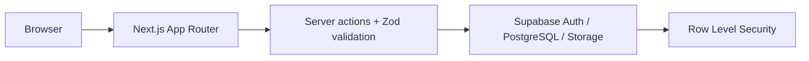
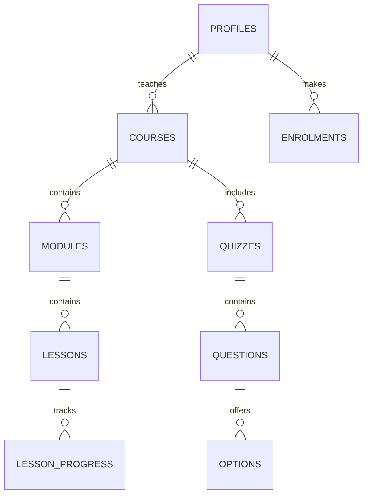

# Verdant Learning

Verdant Learning is a production-oriented Learning Management System built with Next.js App Router, TypeScript, Tailwind CSS, and Supabase.

## Current foundation

- Responsive public landing page with an academic, forest-and-amber visual system
- Supabase-ready normalized schema for profiles, courses, modules, lessons, enrolments, progress, quizzes, announcements, files, and certificates
- Role-aware RLS policy foundation for students, instructors, and admins
- Zod, Supabase SSR, and Lucide dependencies installed for application layers

## Architecture

## Data model

## Setup

1. Install dependencies with `npm install`.
2. Create a Supabase project.
3. Copy `.env.example` to `.env.local` and fill in the Supabase URL and keys.
4. Apply `supabase/migrations/001_initial_schema.sql` in the Supabase SQL editor.
5. Apply `supabase/migrations/002_complete_lms_setup.sql`.
6. In Supabase Authentication, create the demo users listed at the top of `supabase/seed.sql`.
7. Run `supabase/seed.sql` to create the sample catalogue, quiz, announcement, and enrolment.
8. Start the application with `npm run dev`.

The app is deploy-ready for Vercel. Never expose `SUPABASE_SERVICE_ROLE_KEY` to client components or browser code.

## Commands

- `npm run dev` - start local development
- `npm run lint` - run ESLint
- `npm run build` - create a production build
# Verdant
